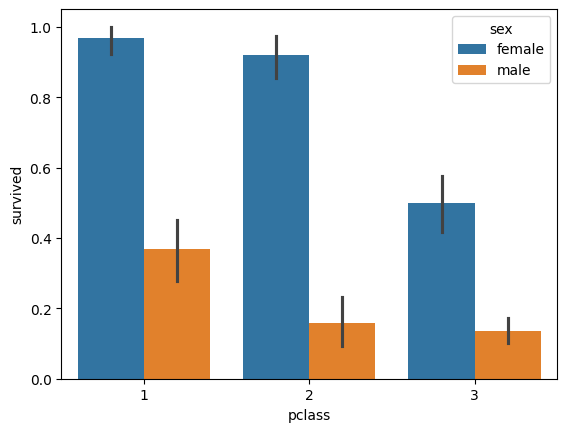
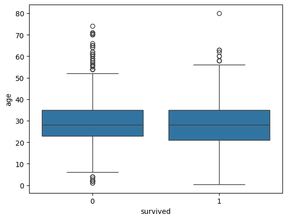
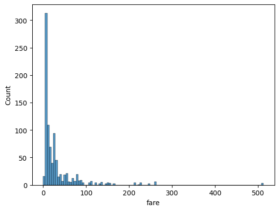

# EDA: Titanic

Разведочный анализ данных о пассажирах Титаника.
Цель — выяснить, какие факторы влияли на выживание.

## Данные
891 пассажир, 15 признаков. Целевая переменная — `survived` (0/1).

## Обработка пропусков
- `deck` — 688 пропусков (77%) → колонка удалена
- `age` — 177 пропусков (20%) → заполнены медианой (распределение скошено)
- `embarked` — 2 пропуска → строки удалены

## Выводы

### 1. Пол — доминирующий фактор
Женщины спасались в 3.9 раза чаще мужчин (74% против 19%). Разрыв по полу внутри каждого класса (36–76 п.п.) превышает разрыв по классу внутри каждого пола (23–47 п.п.). Это соответствует правилу эвакуации «женщины и дети первыми».

### 2. Класс каюты — вторичный, но значимый фактор
Выживаемость падала с 63% в первом классе до 24% в третьем — разрыв в 2.6 раза. Вероятная причина: каюты высших классов располагались на верхних палубах, ближе к шлюпкам, и пассажиров эвакуировали в первую очередь.

### 3. Пол перевешивает деньги
Женщины третьего класса выживали чаще (50%), чем мужчины первого (37%). Социальный протокол эвакуации оказался сильнее имущественного положения.

### 4. Возраст не разделяет группы линейно
Возраст сам по себе не разделяет группы (медианы совпадают, ящики перекрываются). Но если разбить пассажиров по категории `who` — картина резкая: женщины 75%, дети 59%, мужчины 16%. Значит, полезен не сырой возраст, а производный признак «женщина / ребёнок / мужчина». Отсюда следствие для модели: делать feature engineering, а не подавать `age` как есть.

### 5. Данные о цене билета сильно скошены
Распределение `fare` имеет резкий пик у нуля и длинный правый хвост до 512. Среднее завышено выбросами, для описания типичной цены следует использовать медиану. Для модели признак стоит логарифмировать.
