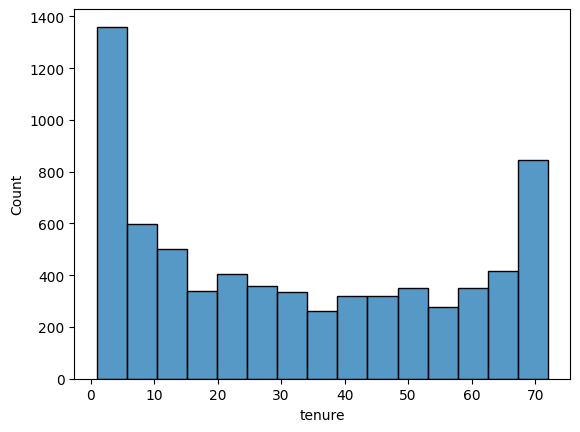
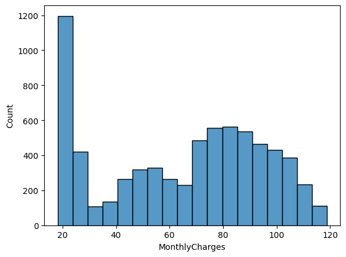
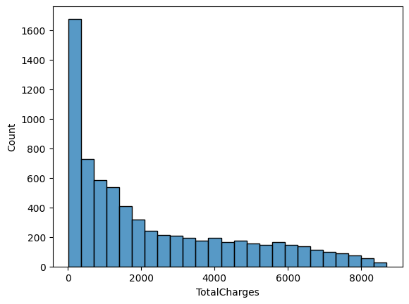
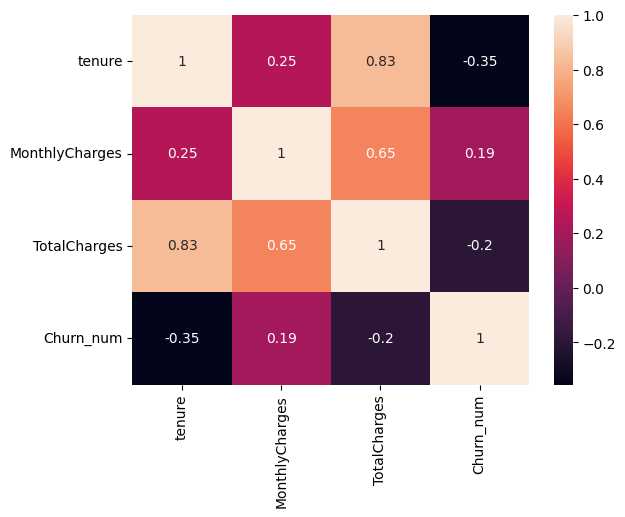

# EDA: Отток клиентов телеком-компании (Telco Churn)

Разведочный анализ данных телеком-компании. Цель — выяснить, какие факторы влияют на отток клиентов (churn), и определить, кого компания теряет чаще всего.
Датасет: [Telco Customer Churn](https://www.kaggle.com/datasets/blastchar/telco-customer-churn) — скачать `telco.csv` и положить в папку `week-06/`.

## Данные
7043 клиента (7032 после чистки), 21 признак. Целевая переменная — `Churn` (ушёл / остался). Базовый уровень оттока — **27%**.

## Вопросы-гипотезы
1. Влияет ли тип контракта на отток?
2. Уходят ли новички чаще, чем давние клиенты?
3. Связан ли отток со стоимостью тарифа и способом оплаты?

## Обработка данных
- **`TotalCharges`** — колонка с суммами читалась как текст из-за 11 строк с пробелом вместо числа (клиенты с нулевым сроком). Переведена в число (`to_numeric`), 11 строк удалены (0.15% данных).
- **`customerID`** — удалён как бесполезный для анализа (уникальный идентификатор, не признак).
- **Дубликаты** — не обнаружены.
- **`Churn`** переведён в бинарный `Churn_num` (0/1) для расчёта долей.

## Ключевые выводы

### 1. Тип контракта — сильнейший предиктор оттока
Помесячный контракт даёт 43% оттока, годовой — 11%, двухлетний — всего 3%. Разрыв в 15 раз. **Рекомендация:** переводить клиентов на длинные контракты через скидки за год/два.

### 2. Способ оплаты — маркер риска
Клиенты, платящие электронным чеком, уходят в 45% случаев против базовых 27%. Автоматические списания (карта, банк) удерживают лучше — около 15%. **Рекомендация:** стимулировать переход на автоплатёж.

### 3. Первые месяцы — критичны
Распределение срока с компанией (`tenure`) бимодальное: много новичков и много старожилов. Отток падает с 48% у новичков до 9.5% у ветеранов. Кто пережил первый год — остаётся надолго. **Рекомендация:** усиленное удержание в первые месяцы.

### 4. Дорогие тарифы теряют клиентов чаще
При высоком ежемесячном платеже отток 36% против 16% у дешёвых тарифов — вдвое выше. Дорогие клиенты требовательнее к соотношению цена/ценность.

### 5. Пол не влияет на отток
Отток мужчин и женщин практически одинаков (26% ≈ 27%) — признак для модели бесполезен.

## Feature Engineering
- **`tenure_group`** — срок разбит на группы (новичок / средний / лояльный / ветеран): связь с оттоком нелинейная, категории информативнее сырого числа.
- **`is_month_to_month`** — бинарный флаг помесячного контракта (сильнейший предиктор: 43% против 7%).
- **One-hot** для `Contract`, `PaymentMethod`, `InternetService` — категории без порядка.
- **`TotalCharges` удалён** из-за мультиколлинеарности с `tenure` (корреляция 0.83) — признаки дублировали информацию.

## Инструменты
pandas · matplotlib · seaborn · SQL-логика (groupby, агрегации)